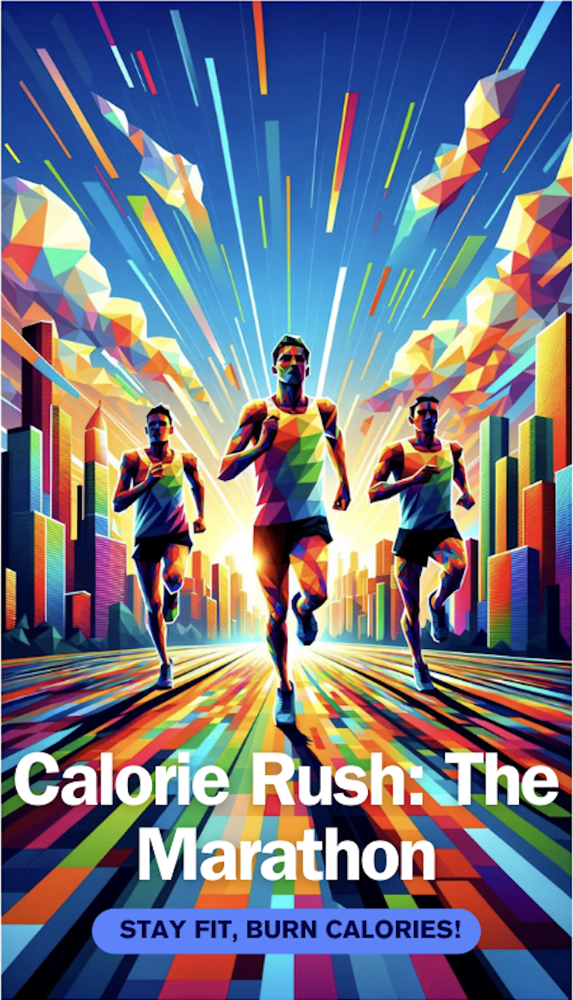

# Calorie Rush: the marathon 

## 1. Introduction

**Game Concept**

“Calorie Rush: The marathon" is an endless mobile runner game, with the idea of engaging in a endless marathon, dodging obstacles and other runners while counting calories and picking up calorie boosting or decreasing items. Purpose The purpose of this document is to provide a comprehensive blueprint for the development of "Calorie Rush: the marathon" Target Audience This game targets players of all ages, who enjoy dynamic game mechanics, collecting items and challenging friends and family. Vision The games vision is to help people enjoy sport and raise awareness of healthy living. In addition, the calorie currency system is designed to reward players who burn more calories. :shipit:

{width = 10, height=20}

## 2. Game Overview

**Genre:**

Casual/ Sports

**Platform(s):**

Mobile IOS

**Game World:**

The game is set on lively and dynamic City streets with poly charm styled buildings and characters.

## 3. Gameplay Mechanics

**Core Gameplay:**

 Dodging obstacles with movements in all directions (UP, DOWN, LEFT, RIGHT). Players can collect items and use boosters to power up their character during a run. Objectives The goal of an endless runner game is of course breaking the personal Highscore and being on top of the overall Highscore with friends and family. Power-ups Players may use in game power-ups to boost their character while pursuing the highscore. At this stage the player has three power-ups as options

## 4. Technical

**Game Engine**

Unity, chosen for its flexibility and support for the targeted platforms.

## 5. Monetization

**In Game Advertising**

Rewarded ads are implemented alongside banner ads, such that the advertising potential is fully emerged, but the game won’t feel to overloaded with advertising influencing the players experience.
